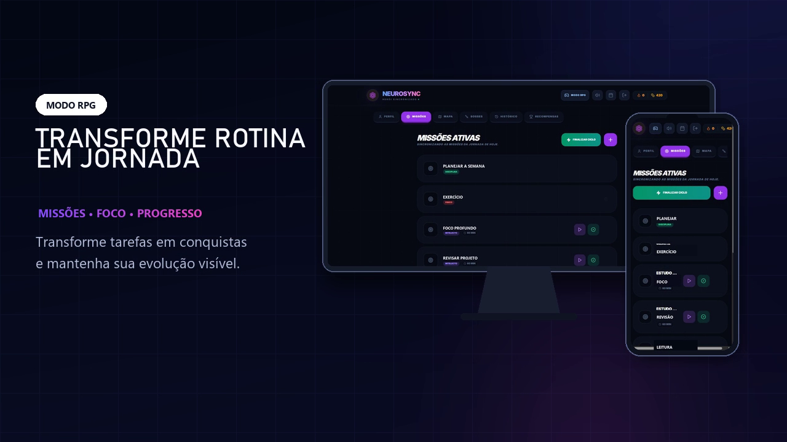

# NeuroSync — organização profissional em um só lugar

O NeuroSync nasceu para organizar a rotina de forma prática: reunir tarefas, projetos, compromissos, tempo de foco e processos seletivos em uma visão que ajude a decidir o que fazer agora e o que acompanhar depois.

Aplicação publicada: https://neurosync-rpg.pages.dev

Repositório: https://github.com/Matheus-EQ/neurosync-app

Aplicação web responsiva com o **Modo Profissional como experiência principal** e uma visualização RPG opcional para quem prefere acompanhar o progresso com elementos de gamificação.

> Projeto pessoal em desenvolvimento. Ainda não é recomendado armazenar informações sensíveis ou depender do aplicativo como única fonte de dados.

## Problema

Listas de tarefas isoladas não mostram, por si só, o que cabe no dia nem como compromissos, dependências e prioridades disputam tempo. O NeuroSync reúne esses elementos e aplica regras de planejamento para formar uma visão executável da rotina.

## Funcionalidades

- tarefas únicas e recorrentes, prioridades, subtarefas e dependências;
- projetos com etapas e acompanhamento de progresso;
- agenda diária, semanal e mensal com compromissos;
- acompanhamento de processos seletivos, vagas, testes e entrevistas integrado à agenda;
- planejamento diário e organização automática baseada em regras;
- divisão de tarefas em sessões e cronômetro de foco;
- conclusão, reabertura, encerramento do dia e reagendamento de pendências;
- histórico e indicadores de execução;
- modo demonstração sem cadastro, isolado no navegador;
- cadastro, confirmação de e-mail, login, logout e recuperação de senha via Supabase.

## Modos de experiência

**Profissional (principal):** interface sóbria com visão “Hoje”, caixa de entrada, prioridades, projetos, processos seletivos, capacidade do dia, agenda e relatórios.

**RPG (alternativo):** apresenta tarefas como missões e projetos como desafios, com atributos, níveis, pontos de experiência e moedas. A gamificação é uma camada opcional e não substitui o foco do produto em organização.

## Stack

- React 18 e React Router;
- Vite 6;
- Tailwind CSS e componentes Radix UI;
- TanStack Query;
- Supabase Auth, Postgres e Row Level Security (RLS);
- Cloudflare Pages para o frontend estático.

## Arquitetura resumida

O frontend consulta o Supabase usando apenas a chave anônima pública. Cada registro persistido possui `created_by_id`; as políticas RLS limitam leitura e escrita ao usuário autenticado. O workspace profissional é salvo em uma coluna JSONB e também possui uma cópia local para continuidade no dispositivo. Preferências de interface e cronômetro usam `localStorage`.

No modo demonstração, um usuário fictício e coleções próprias são criados com o prefixo `neurosync:demo:`. A sessão é marcada em `sessionStorage`, o cliente Supabase é ignorado e nenhuma operação alcança o banco de produção.

## Imagens

### Experiência principal — Modo Profissional


<details>
<summary>Visualização alternativa em modo RPG</summary>



</details>

## Instalação local

Requisitos: Node.js 20 ou superior e pnpm.

```powershell
pnpm install
Copy-Item .env.example .env
pnpm dev
```

Preencha o `.env` local com as credenciais públicas do seu projeto Supabase:

```dotenv
VITE_SUPABASE_URL=https://exemplo.supabase.co
VITE_SUPABASE_ANON_KEY=chave_anonima_publica_de_exemplo
```

Nunca use `service_role` no frontend.

## Comandos

```bash
pnpm dev        # servidor local
pnpm lint       # análise estática
pnpm typecheck  # verificação de tipos do JavaScript/JSX
pnpm build      # build de produção
pnpm preview    # prévia do build
```

## Estrutura

```text
src/
  api/          cliente de dados e autenticação
  components/   interface compartilhada e recursos do NeuroSync
  lib/          planejamento, sessão, demonstração e utilitários
  pages/        landing, autenticação, páginas legais e aplicativo
supabase/        schema, migrações e modelos de e-mail
public/          ícones, cabeçalhos, redirecionamento e mídia
```

## Autenticação e persistência

1. Execute `supabase/schema.sql` em um projeto novo ou somente as migrações ainda pendentes.
2. Configure a URL do site e as URLs de redirecionamento no Supabase.
3. Ative confirmação obrigatória de e-mail antes da divulgação pública.
4. Configure SMTP próprio para entrega confiável.

As políticas RLS e a migração de exclusão foram verificadas no ambiente remoto em 10 de setembro de 2026. O arquivo `supabase/delete-account-migration.sql` permanece como fonte versionada e reproduzível da função.

## Deploy

O processo atual usa Cloudflare Pages com build `pnpm build` e diretório de saída `dist`. As instruções completas, variáveis e validações pré-publicação estão em [DEPLOYMENT.md](DEPLOYMENT.md).

## Limitações conhecidas

- a confirmação de que as RLS locais correspondem ao ambiente remoto é manual;
- a sincronização profissional depende da migração `professional_workspaces`;
- não há colaboração entre usuários, notificações push ou aplicativo nativo;
- os textos de Privacidade e Termos descrevem o estado atual, mas não substituem revisão jurídica profissional;
- solicitações públicas são recebidas pelas Issues do repositório; dados sensíveis não devem ser publicados ali;
- não existe integração com modelo de inteligência artificial; o planejamento é baseado em regras.

## Roadmap

- ampliar os testes automatizados do modo demonstração publicado;
- reforçar testes automatizados dos fluxos principais;
- melhorar observabilidade e tratamento offline;
- revisar acessibilidade com tecnologias assistivas;
- avaliar exportação e portabilidade de dados.

## Licença

Ainda não há licença definida. O código não deve ser considerado open source até a inclusão explícita de um arquivo de licença.
