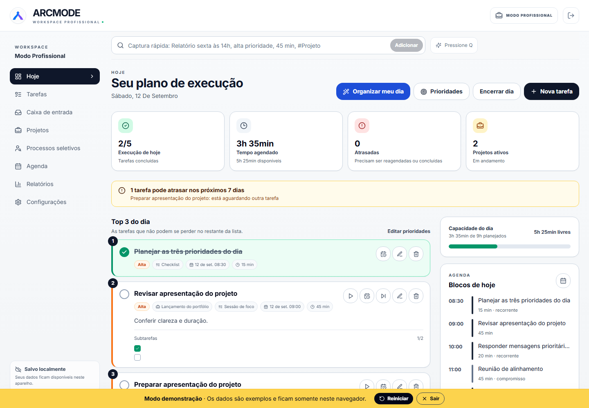
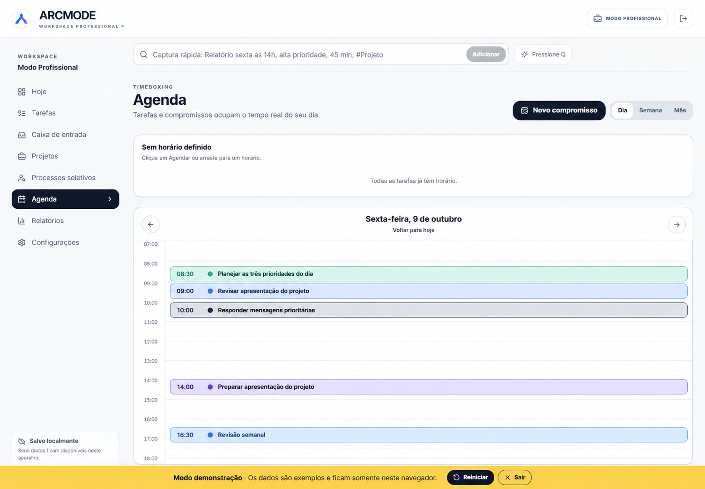
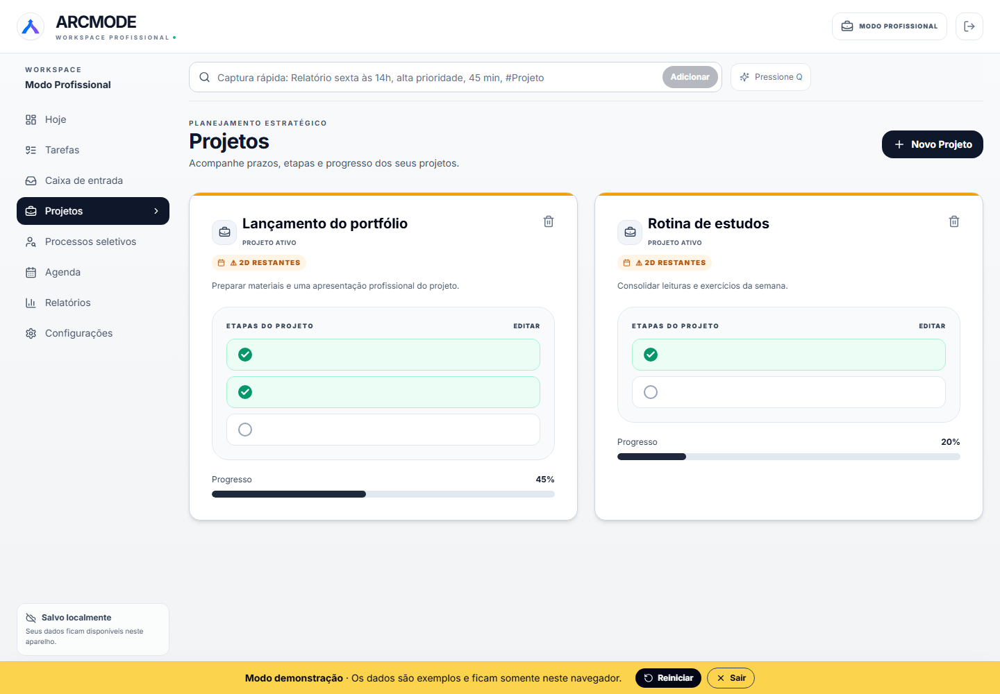
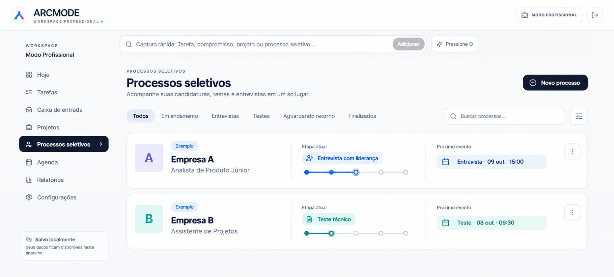
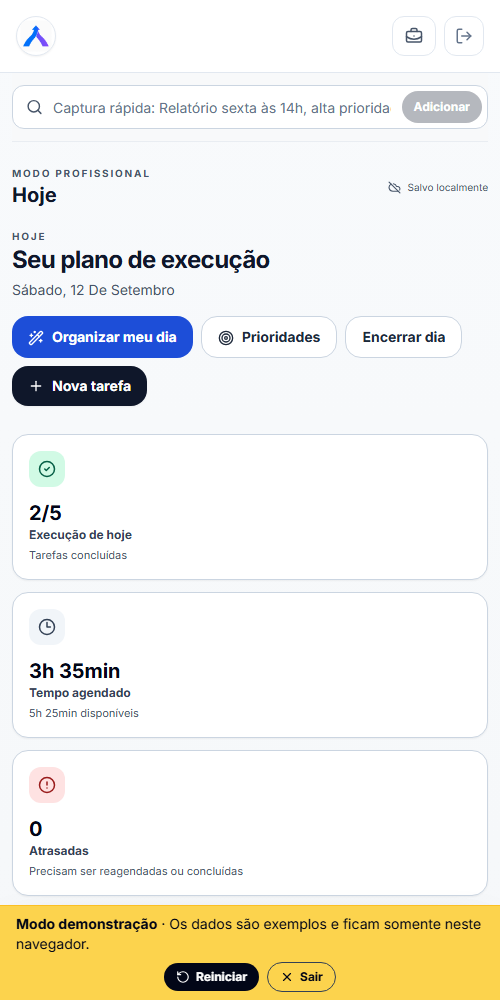
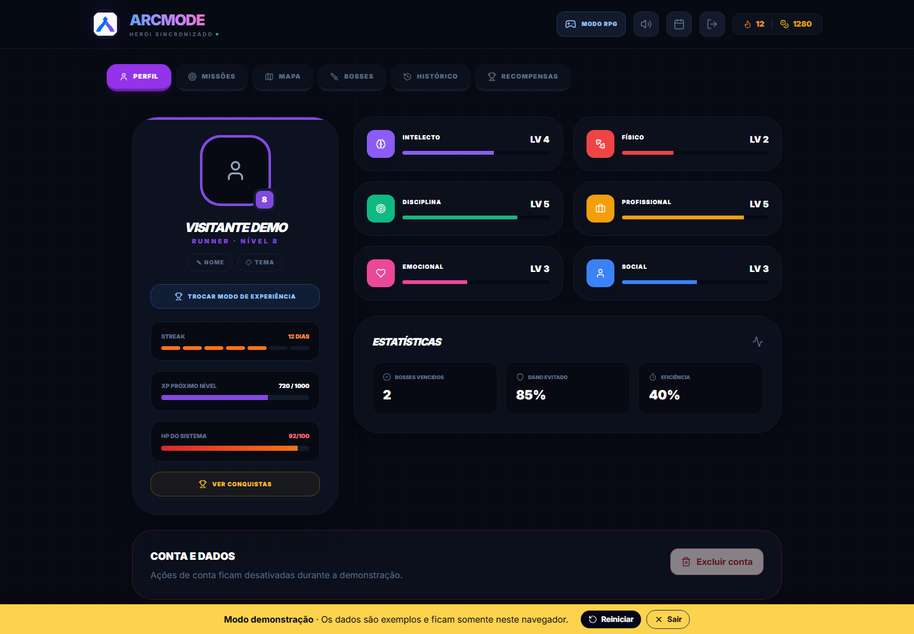

# ArcMode — organização e planejamento da rotina

O ArcMode é um projeto pessoal em desenvolvimento para reunir tarefas, projetos, compromissos e processos seletivos em um só lugar. O foco é ajudar a transformar atividades e prazos em um plano realista, com prioridades e horários visíveis.

[Abrir o app](https://arcmode-app.pages.dev/) · [Experimentar a demonstração](https://arcmode-app.pages.dev/app?demo=1)

> **Status:** ainda em desenvolvimento. A interface e algumas funcionalidades seguem em validação e podem mudar. A demonstração usa dados fictícios e fica isolada no navegador. Evite inserir informações sensíveis ou depender do app como único registro de compromissos.

## Organização em primeiro lugar

O ArcMode busca conectar quatro partes da rotina:

- **Tarefas e prioridades:** organize o que precisa ser feito, considerando prazos, recorrências e dependências.
- **Planejamento e agenda:** distribua tarefas e compromissos ao longo do dia e alterne entre as visões diária, semanal e mensal.
- **Projetos:** acompanhe etapas, próximos passos e progresso sem perder as tarefas relacionadas.
- **Processos seletivos:** registre vagas, testes e entrevistas e acompanhe datas e andamento junto à agenda.

Também há sessões de foco, cronômetro e revisão do que foi concluído. O planejamento é baseado em regras da aplicação; não há integração com inteligência artificial.

## Dois modos, com objetivos diferentes

### Modo Profissional — experiência principal

É o espaço central para organizar a rotina: tarefas, prioridades, projetos, processos seletivos, capacidade do dia e agenda. A proposta é oferecer uma visão direta do que fazer agora e do que precisa de acompanhamento.

### Modo RPG — alternativa opcional

É uma camada de gamificação para quem prefere acompanhar a execução como uma jornada: tarefas viram missões e o progresso pode aparecer como evolução de personagem, atributos, bosses e recompensas. O RPG é secundário; a organização da rotina continua sendo o propósito central do ArcMode.

## Visão do produto

As imagens abaixo são **mockups ilustrativos** com dados fictícios, criados para apresentar os fluxos do produto. Não são capturas literais da versão publicada.

### 1. Modo Profissional no computador



### 2. Calendário diário, com opções semanal e mensal



### 3. Projetos e acompanhamento de etapas



### 4. Processos seletivos, testes e entrevistas



### 5. Modo Profissional no celular

<p align="center">
  
</p>

### 6. Modo RPG — uma prévia da alternativa gamificada



## Demonstração

A demonstração pode ser explorada sem criar uma conta. Os registros de exemplo são fictícios e ficam isolados neste navegador; não representam vagas ou compromissos reais.

## Executar localmente

Requisitos: Node.js 20 ou superior e pnpm.

```powershell
pnpm install
Copy-Item .env.example .env
pnpm dev
```

Configure no `.env` as credenciais públicas do projeto Supabase:

```dotenv
VITE_SUPABASE_URL=https://exemplo.supabase.co
VITE_SUPABASE_PUBLISHABLE_KEY=chave_publicavel_de_exemplo
VITE_BILLING_REQUIRED=false
VITE_HOTMART_CHECKOUT_URL=
```

Nunca use `service_role` no frontend.

## Estado e próximos passos

O trabalho segue em evolução, com atenção à clareza do planejamento, à confiabilidade dos fluxos e à experiência em telas menores. O roadmap atual inclui ampliar os testes automatizados, melhorar o tratamento offline, revisar acessibilidade e avaliar exportação e portabilidade dos dados.

## Documentação do repositório

- [Auditoria e limitações conhecidas](AUDIT.md)
- [Configuração e publicação](DEPLOYMENT.md)
- [Preparação comercial](HOTMART_SETUP.md)

Ainda não há uma licença definida para o código; a publicação do repositório, por si só, não concede uma licença de uso.

## Contato

Questões sobre o projeto: [arcmodeapp@gmail.com](mailto:arcmodeapp@gmail.com).
